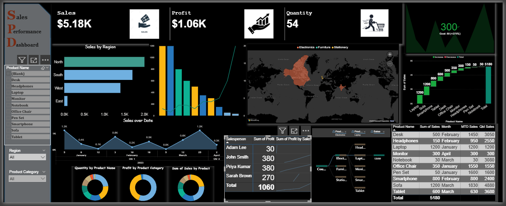

Sales Performance Dashboard 📊

> A comprehensive business intelligence dashboard for real-time sales analytics, regional performance tracking, and product-level insights.
> 


🎯 Overview

The Sales Performance Dashboard is a data visualization solution designed to provide actionable insights into sales operations. 
It consolidates multiple data dimensions including regional sales, product performance, salesperson metrics, and temporal trends 
into a single, intuitive interface.

Features

📈 Key Performance Indicators (KPIs)
- Real-time Sales Tracking: Monitor total sales revenue ($5.18K)
- Profit Analysis: Track profitability metrics ($1.06K)
- Volume Metrics: Quantity sold monitoring (54 units)

🗺️ Geographic Analysis
- Interactive world map visualization
- Regional sales breakdown (North, South, East, West)
- Product category distribution by geography (Electronics, Furniture, Stationery)

🔍 Interactive Filtering
- Product name filtering
- Product category selection
- Date range filtering
- Dynamic dashboard updates

👥 Sales Team Metrics
Track individual performance:
- Adam Lee: 60 units
- John Smith: 380 units
- Priya Kumar: 380 units
- Sarah Brown: 270 units
- Total: 1060 units

📦 Product Categories

The dashboard tracks performance across multiple product lines:

- 📱 Electronics (Laptop, Smartphone, Tablet, Headphones)
- 🪑 Furniture (Desk, Office Chair)
- 📓 Stationery (Notebook, Pen Set)
- 🖥️ Accessories (Monitor, Sofa)


2. Open the dashboard file

For Power BI
open sales_Performance_Dashboard.pbix


3. Configure data connections
- Update data source credentials
- Refresh data connections
- Verify data refresh schedule

📊 Data Structure

Expected data schema:

Sales Data:
- Product Name
- Product Category
- Sales Amount
- Profit
- Quantity
- Region
- Date
- Salesperson

Geographic Data:
- Region Name
- Coordinates
- Territory

🛠️ Configuration

Customization Options
- Update color schemes in theme settings
- Modify KPI thresholds
- Adjust date ranges and filters
- Configure data refresh intervals

📱 Dashboard Sections

Left Panel
- Product filtering controls
- Category selection
- Navigation menu

Main Canvas
- KPI summary cards
- Regional performance charts
- Time-series analysis
- Product distribution visualizations
- Geographic heat map

Right Panel
- Detailed product metrics table
- Month-to-date (MTD) statistics
- Quarter-to-date (QTD) figures
- Salesperson performance summary


🎯 Key Insights Delivered

- Which regions are performing best/worst
- Top and bottom performing products
- Sales trends and seasonality patterns
- Individual salesperson contributions
- Profit margins by product category
- Geographic market penetration

🤝 Contributing

Contributions are welcome! Please follow these steps:

1. Fork the repository
2. Create a feature branch (`git checkout -b feature/AmazingFeature`)
3. Commit your changes (`git commit -m 'Add some AmazingFeature'`)
4. Push to the branch (`git push origin feature/AmazingFeature`)
5. Open a Pull Request

📝 Best Practices

- Refresh data regularly for accuracy
- Review KPIs during weekly team meetings
- Use filters to drill down into specific insights
- Export reports for stakeholder presentations
- Monitor data quality and anomalies

🔒 Data Privacy

- Ensure compliance with data protection regulations
- Implement role-based access control
- Sanitize sensitive information before sharing
- Follow organizational data governance policies

👤 Author
Eliyas N

- GitHub:   https://github.com/EliyasN
- LinkedIn: www.linkedin.com/in/eliyas-n


🙏 Acknowledgments

- Dashboard design inspired by modern BI best practices
- Data visualization principles from Tufte and Few
- Community feedback and contributions


🗺️ Roadmap

- [ ] Add predictive analytics module
- [ ] Implement customer segmentation analysis
- [ ] Mobile-responsive version
- [ ] Real-time data streaming
- [ ] AI-powered insights and recommendations
- [ ] Export to PDF/Excel functionality


*Last Updated: October 2025*
```
